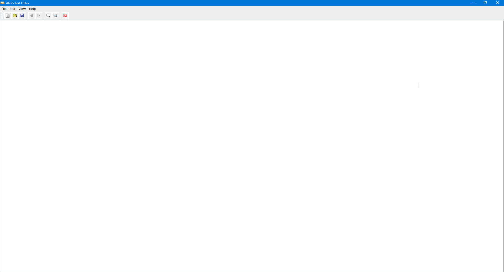

# Simple-Text-Editor
This is the first java swing project I created to help me learn Java. I have recently given it a much needed refactoring.

I have used an open source project called JFontChooser for my font chooser: http://jfontchooser.sourceforge.net/

